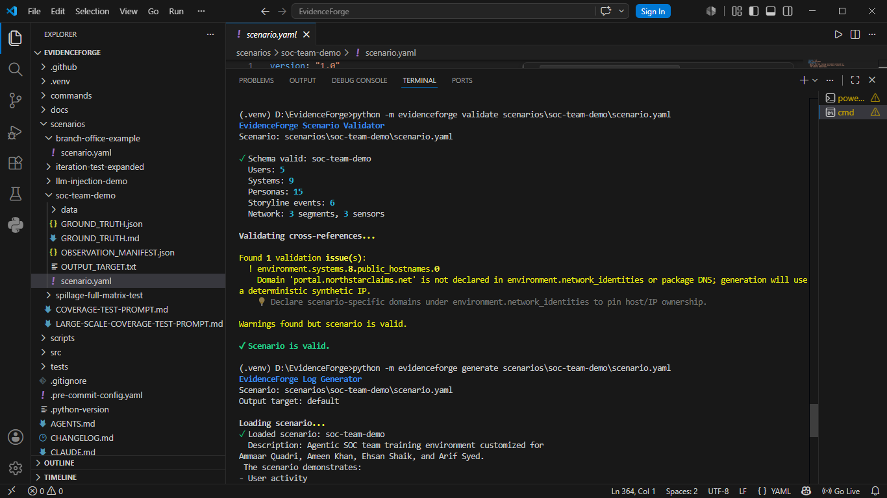
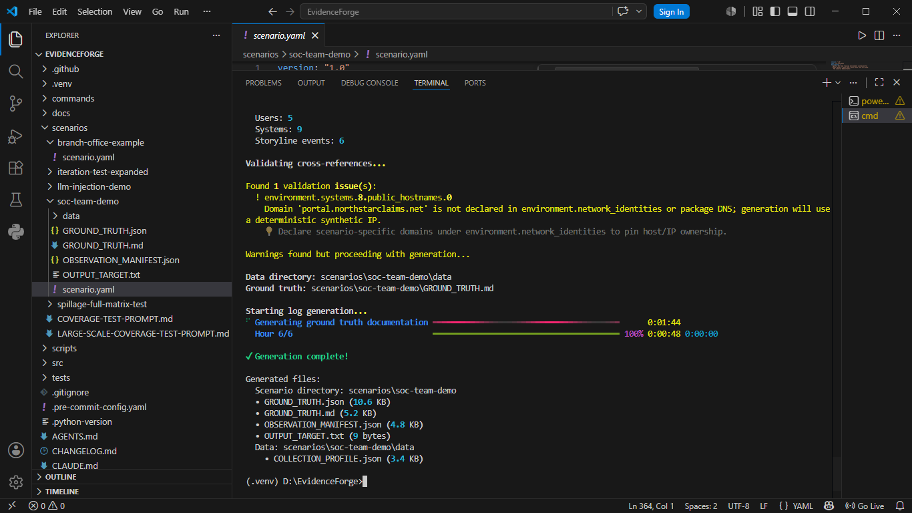
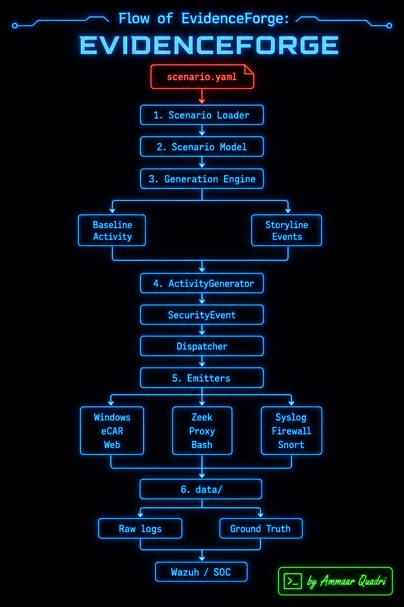

# EvidenceForge Generated Dataset

Synthetic Security Telemetry Dataset Generated Using Cisco Talos EvidenceForge

This repository contains realistic multi-source cybersecurity logs generated from EvidenceForge scenarios for Threat Hunting, SOC Analysis, Detection Engineering, Security Research, and Agentic SOC development.

Repository Maintainer:
Ammaar Quadri

# EvidenceForge Generated Dataset

## Overview

This repository contains a complete synthetic cybersecurity dataset generated using Cisco Talos EvidenceForge.

The dataset was generated from the official Branch Office Example scenario and demonstrates how a realistic enterprise environment can be simulated to produce correlated security logs across multiple platforms, operating systems, network devices, and monitoring tools.

The primary purpose of this dataset is:

- Threat Hunting Practice
- SOC Analyst Training
- Detection Engineering
- Log Analysis
- Security Research
- SIEM Testing
- Incident Investigation Exercises
- Autonomous SOC Development

---

## About EvidenceForge

EvidenceForge is an open-source framework developed by Cisco Talos that generates realistic synthetic security logs for cybersecurity training and research.

Instead of manually collecting logs from real environments, EvidenceForge creates a complete enterprise environment and generates:

- Windows Event Logs
- Sysmon Logs
- Zeek Network Logs
- Cisco ASA Firewall Logs
- Snort IDS Alerts
- Proxy Logs
- Web Server Logs
- Linux Syslog
- Bash History
- Ground Truth Documentation

All generated logs are time-correlated and internally consistent.

---

## Scenario Used

### Branch Office Example

This scenario simulates a small branch office environment consisting of:

- Windows Workstations
- Domain Controller
- File Server
- Web Server
- Proxy Server
- Firewall
- IDS Sensor
- Zeek Network Monitoring Sensor

The attack storyline demonstrates:

1. External Reconnaissance
2. Initial Access
3. Administrative Account Compromise
4. Internal Movement
5. Network Activity Generation
6. Command and Control Communication

---

```text
EvidenceForge-Generated-Dataset
│
├── README.md
│
├── Branch-Office-Example
│   ├── scenario.yaml
│   ├── GROUND_TRUTH.md
│   ├── GROUND_TRUTH.json
│   ├── OBSERVATION_MANIFEST.json
│   └── data/
│
├── SOC-Team-Demo
│   ├── scenario.yaml
│   ├── GROUND_TRUTH.md
│   ├── GROUND_TRUTH.json
│   ├── OBSERVATION_MANIFEST.json
│   └── data/
│
└── docs
```

---

## Dataset Contents

```text
EvidenceForge-Generated-Dataset
│
├── scenario.yaml
├── GROUND_TRUTH.md
├── GROUND_TRUTH.json
├── OBSERVATION_MANIFEST.json
├── OUTPUT_TARGET.txt
│
└── data/
    │
    ├── DC-BO-01.northstar-branch.local
    ├── FILE-BO-01.northstar-branch.local
    ├── FW-BO-EDGE
    ├── IDS-BO-EDGE
    ├── PROXY-BO-01.northstar-branch.local
    ├── WEB-BO-01.northstar-branch.local
    ├── WS-LMORRIS-01.northstar-branch.local
    ├── WS-MPATEL-01.northstar-branch.local
    ├── WS-NKAPOOR-01.northstar-branch.local
    ├── WS-OREED-01.northstar-branch.local
    ├── WS-VHALE-01.northstar-branch.local
    └── ZEEK-BO-CORE
```

---

## Included Scenarios

This repository currently contains multiple generated scenarios:

### 1. Branch Office Example

Official EvidenceForge example scenario demonstrating:

- Web Reconnaissance
- Initial Access
- Discovery
- Lateral Movement
- Data Collection
- Command & Control Communication

### 2. SOC Team Demo

Custom scenario created for training and demonstration purposes involving:

- Ammaar
- Ameen
- Ehsan
- Arif

This scenario was developed to understand how custom users, systems, attack timelines, and security telemetry can be modeled and generated using EvidenceForge.

---

## EvidenceForge Generation Workflow

```text
┌─────────────────────────────┐
│  Scenario Definition (YAML) │
└──────────────┬──────────────┘
               │
               ▼
┌─────────────────────────────┐
│     Scenario Validation     │
└──────────────┬──────────────┘
               │
               ▼
┌─────────────────────────────┐
│      Generation Engine      │
└──────────────┬──────────────┘
               │
               ▼
┌─────────────────────────────┐
│   Causal Expansion Engine   │
└──────────────┬──────────────┘
               │
               ▼
┌─────────────────────────────┐
│  Multi-Format Log Creation  │
└──────────────┬──────────────┘
               │
               ▼
┌─────────────────────────────┐
│  Ground Truth Generation    │
└──────────────┬──────────────┘
               │
               ▼
┌─────────────────────────────┐
│       Dataset Output        │
└─────────────────────────────┘
```

---

## Cross-Log Correlation

EvidenceForge maintains consistency across all generated log sources.

Shared artifacts include:

- Logon IDs
- Process IDs (PIDs)
- User Accounts
- Hostnames
- IP Addresses
- Timestamps
- Zeek UIDs

This allows analysts to correlate activity across:

- Windows Logs
- Sysmon
- Zeek
- Proxy Logs
- Firewall Logs
- IDS Alerts
- Linux Syslog

just as they would in a real enterprise investigation.

---

## Generated Log Sources

### Windows Systems

Generated logs:

- Windows Security Events
- Sysmon Events
- ECAR Records

Files:

```text
windows_event_security.xml
windows_event_sysmon.xml
ecar.json
```

These logs contain:

- User Logons
- Process Creation
- Registry Activity
- File Operations
- Authentication Events
- System Activity

---

### Cisco ASA Firewall

Generated log:

```text
cisco_asa.log
```

Contains:

- Allowed Connections
- Blocked Connections
- Session Activity
- Firewall Events

---

### Snort IDS

Generated log:

```text
snort_alert.log
```

Contains:

- Intrusion Alerts
- Reconnaissance Detection
- Suspicious Traffic Events

---

### Proxy Server

Generated logs:

```text
proxy_access.log
syslog.log
```

Contains:

- User Web Activity
- URL Requests
- Internet Access Records

---

### Linux Systems

Generated logs:

```text
syslog.log
bash_history
```

Contains:

- Linux Commands
- System Activity
- Administrative Operations

---

### Zeek Network Monitoring

Generated logs:

```text
conn.json
dns.json
http.json
ssl.json
x509.json
dhcp.json
files.json
ntp.json
ocsp.json
pe.json
```

Provides visibility into:

- Network Connections
- DNS Queries
- HTTP Traffic
- SSL/TLS Activity
- Certificate Information
- DHCP Assignments
- File Transfers
- Time Synchronization
- Executable Metadata

---

## Ground Truth

One of the most valuable outputs generated by EvidenceForge is:

```text
GROUND_TRUTH.md
```

This document provides:

- Attack Timeline
- Attack Narrative
- Indicators of Compromise (IOCs)
- Systems Involved
- User Accounts Involved
- Adversary Actions

This allows analysts to validate detections and investigation results against the known truth.

---

## Observation Manifest

File:

```text
OBSERVATION_MANIFEST.json
```

Purpose:

Documents which security controls and sensors observed each activity.

Useful for:

- Detection Engineering
- Sensor Coverage Analysis
- Visibility Gap Assessment

---

---

# Validation and Generation

The scenario was first validated using the EvidenceForge Scenario Validator to ensure that the YAML configuration was syntactically correct and all references were properly resolved.

### Validate Scenario

**Command**

```bash
python -m evidenceforge validate scenarios\soc-team-demo\scenario.yaml
```

<p align="center">
  
</p>

---

After successful validation, the scenario was executed using the EvidenceForge Generation Engine to create synthetic telemetry, ground-truth artifacts, and multi-format security logs.

### Generate Dataset

**Command**

```bash
python -m evidenceforge generate scenarios\soc-team-demo\scenario.yaml
```

<p align="center">
  
</p>

---

### Result

The generation process produced:

- Ground Truth Documentation (`GROUND_TRUTH.md`)
- Ground Truth JSON (`GROUND_TRUTH.json`)
- Observation Manifest (`OBSERVATION_MANIFEST.json`)
- Multi-format Security Logs
- Host-specific Log Directories
- Network Telemetry
- Windows Security Events
- Sysmon Events
- Zeek Logs
- Snort IDS Alerts
- Cisco ASA Firewall Logs
- Proxy and Web Access Logs

These outputs can be used for Threat Hunting, Detection Engineering, SOC Training, Incident Response, and Autonomous Security Research.

---

## Learning Outcomes

Through this project the following concepts were explored:

- Synthetic Data Generation
- Threat Hunting
- Detection Engineering
- Log Correlation
- Ground Truth Analysis
- Security Telemetry
- SOC Workflows
- GitHub Collaboration
- Agentic SOC Research

---

## Use Cases

This dataset can be used for:

### SOC Training

Practice:

- Alert Triage
- Log Analysis
- Incident Investigation

### Threat Hunting

Search for:

- Lateral Movement
- Reconnaissance Activity
- Suspicious Authentication Events
- Command and Control Traffic

### Detection Engineering

Build and test:

- Sigma Rules
- SIEM Queries
- Detection Pipelines

### AI Security Research

Suitable for:

- Autonomous SOC Development
- Agentic Security Workflows
- Security Dataset Analysis
- Threat Intelligence Correlation

---

## Work Flow of EvidenceForge

<p align="center">
  
</p>

---

## Repository Purpose

This repository was created as part of research and learning activities related to:

- EvidenceForge
- Threat Hunting
- Detection Engineering
- Agentic SOC Systems
- LangGraph-Based Security Agents

The goal is to understand how realistic security datasets can be generated and utilized for cybersecurity operations.

---

## Generated Using

- Cisco Talos EvidenceForge
- Python 3.12
- Windows 10 Environment

---

## Implemented by

**Ammaar Quadri**

Cybersecurity Researcher | SOC Engineering Enthusiast

GitHub:
https://github.com/ammaarquadri

---

## Disclaimer

This repository contains synthetic security data generated for educational, research, and training purposes only.

No real users, systems, organizations, or production environments are represented in this dataset.
